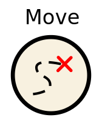
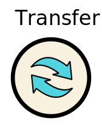
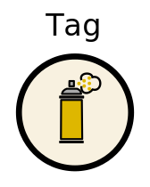
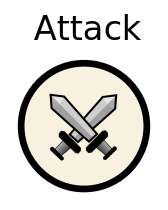

Goal of this first tutorial is to understand programming ants. 
Each iteration ants can execute one specific action:

	[]{@tutorial 01_moving}
	[]{@tutorial 02_harvest}
	[]{@tutorial 03_transfer} 
	[]{@tutorial 04_tag}
	[]{@tutorial 05_attack}

Key to survival is using these action commands the best way possible. 
In this tutorial you will create your own basic code using all of those actions. 

Let's start with [Moving]{@tutorial 01_moving}