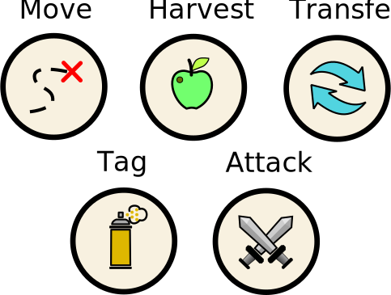

Goal of this first tutorial is to understand programming ants. 
Each iteration ants can execute one specific action:

Key to survival is using these action commands the best way possible. 
In this tutorial you will create your own basic code using all of those actions. 

Let's start with {@tutorial 01_moving}