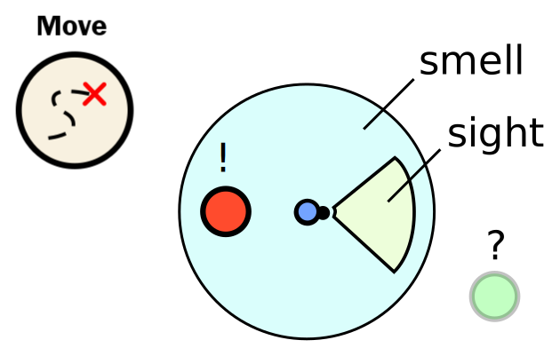
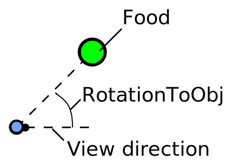

Ants in this simulation do not know where they are exactly.<br>
They only know what they see and smell. All other objects are unknown.



Each ant though can <b>turn around and walk</b> to perceive more of its surroundings.
The direction and rotation are both <b>relative</b> to the ants current location and rotation.


### Move command
The command looks like this: 
```javascript
[ActionType.MOVE, DirectionType.<direction>, <rotation>];
```
The <direction> parameter can be FORWARD, BACKWARD or NONE.<br>
<b>Keep in mind</b>: Ants can't move backwards as fast as they move forwards.

Rotations are always given in degree relative to the ants current heading.
If you like to use radians just convert it with 
```javascript 
var degree = radToDeg( radians )
```

#### Examples:
```javascript
[ActionType.MOVE, DirectionType.NONE, 25];        // rotate 25° to the left
[ActionType.MOVE, DirectionType.FORWARD, radToDeg(-0.7854)];    // rotate 45° to the right
[ActionType.MOVE, DirectionType.BACKWARD, rand(-30, 30)]; // walk backward with a random rotation (-30°,30°)
```

### Rotation towards objects
By moving around the ants perception of the world changes.
Distance and rotation to other objects are updated each iteration.



The rotation angle towards something can be returned by
```javascript 
var nearestFood = this.getNearestObjectType(ObjectType.FOOD);
var rotationTowardsFood = nearestFood.getRotationToObj();
```

# Try it yourself!<br>
<link rel="stylesheet" href="../style.css">
A little hands on:<br>
By default the ant walks randomly around.
Try to let the ant walk towards the green food source!
<div style="width:850px;">
	<div style="width:550px; float:left;">
		<input type="number" value="1" id="tutorialPart" style="display:none">
		<input type="button" value="run" id="runTutorial" >
		<input type="button" value="cheat" id="cheat" >
		<div id="customAntContainer" style="height:150px;margin:10px;">
			<pre id="editor"></pre>
		</div>
	</div>
	<div style="width:250px; float:right;">
		<canvas width="250" height="200" class="terrarium" id="canvasTutorial"></canvas>
	</div>
	<div style="clear:both;"></div>
</div>
<div id="finished" style="display:none;">
	<b>Congratulations!</b><br>
	You can now continue with the [Harvest]{@tutorial 02_harvest} tutorial.
</div>

<script src="../js/external/ace_min_noconflict/ace.js"></script>
<script src="../js/external/ace_min_noconflict/ext-language_tools.js"></script>

<script src="../js/settingsGlobal.js"></script>
<script src="../js/debug.js"></script>
<script src="../js/globals.js"></script>

<script data-main="../js/initTutorial" src="../js/external/require.js"></script>