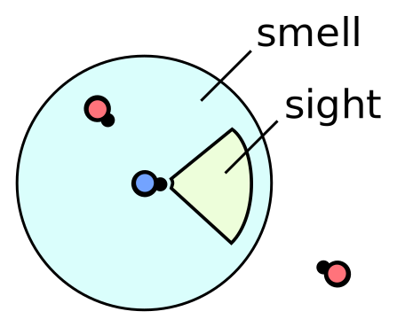

Ants in this simulation do not know where they are exactly.<br>
They only know what they see and smell. All other objects are unknown.



Each ant though can <b>turn around and walk</b> to perceive more of its surroundings.
The direction and rotation are both <b>relative</b> to the ants current location and rotation.

### Move command

The command looks like this: 
```javascript
[ActionType.Move, <Direction>, <Rotation>];
```
The direction parameter can be Direction.FORWARD | BACKWARD | NONE.
Rotations are always given in radians relative to the ants current heading.
If you still like to use degree just convert it with 
```javascript 
var radians = degToRad( degree )
```

#### Examples:
```javascript
[ActionType.Move, Direction.NONE, degToRad(25)];        // rotate 25° to the left
[ActionType.Move, Direction.FORWARD, degToRad(-15)];    // rotate 15° to the right
[ActionType.Move, Direction.BACKWARD, rand(-0.5, 0.5)]; // walk backward with a random rotation
```

### Maximum rotation

The maximum rotation value depends on the direction.
Standing still allows the most rotation, whereas walking backwards minimizes rotation.<br>
The exact maximum rotation can be returned by
```javascript 
var maxRotation = this.getMaximumRotation(<Direction>);
```

### Rotation towards objects

By moving around the ants perception of the world changes.
Distance and rotation to other objects are updated each iteration.


The rotation angle towards something can be returned by
```javascript 
var nearestFood = this.getNearestObjectType(ObjectType.FOOD);
var rotationTowardsFood = nearestFood.getRotationToObj();
```

# Try it yourself!<br>
Close this window and try to let the ant walk towards the green food source!

Afterwards you can continue with the [Harvest]{@tutorial 02_harvest} tutorial.