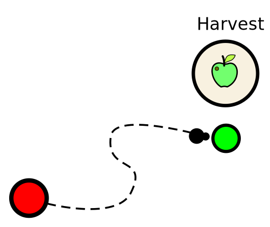

For the queen to thrive and increase their ant numbers she need food.
If a certain amount of food is harvested and brought to the hive, a new ant is born.



### Harvest command
The command looks like this: 
```javascript
[ActionType.HARVEST, <object>];

// examples:
[ActionType.HARVEST, food];        // harvest food from food source
[ActionType.HARVEST, dead_spider]; // harvest food from a dead spider
[ActionType.HARVEST, dead_ant];    // cannibalism

```
Note: Normally ants don't cannibalise other ants. In this simulation though, it's a fight for survival!<br>


#### Memory:
<b>Ants can memorize everything they experience.</b><br>
Finding a straight way back home for example is achieved by memorizing direction (position of the sun) and walking distance.<br>
In this simulation though an ant can memorize everything you want with
```javascript
this.memory.<some topic> = <value>;

// examples:
this.memory.carryingFoodHome = true; // Ant wants to bring food home
this.memory.totalFoodCarried = 200; // Ant counts how many food was carried
this.memory.distanceToHive = 10; // Ant tracks distace to hive
```

# Try it yourself!<br>
<link rel="stylesheet" href="../style.css">
A little hands on:<br>
By default the ant walks towards the food location.
This resembles one possible solution to the previous tutorial.<br>
Try now to enhance the code to let the ant walk back with full hands!

<script src="../js/external/ace_min_noconflict/ace.js"></script>
<script src="../js/external/ace_min_noconflict/ext-language_tools.js"></script>
<script src="../js/settingsGlobal.js"></script>
<script src="../js/debug.js"></script>
<script src="../js/globals.js"></script>
<script data-main="../js/initTutorial" src="../js/external/require.js"></script>
<input type="number" value="2" id="tutorialPart" style="display:none">

<div id="finished" style="display:none;">
	<b>Congratulations!</b><br>
	You can now continue with the [Transfer]{@tutorial 03_transfer} tutorial.
</div>