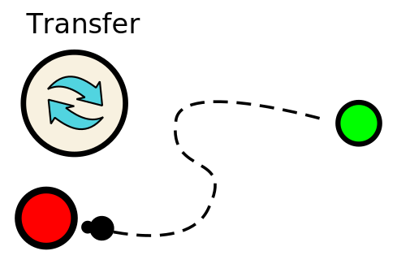

The queen inside the hive can give birth to more ants if enough food is gathered.
After an ant has harvested food somewhere, it has to deposit it in its hive. 



To transfer food from an ant to the hive or another ant, the transfer command is used.

### Transer command
The command looks like this: 
```javascript
[ActionType.TRANSFER, <object>, <amount>];

// examples:
[ActionType.TRANSFER, otherAnt, 10]; // transfers 10 food to 'otherAnt'
[ActionType.TRANSFER, hive, 25]; // transfers 25 food to 'hive'
```

The ant has to be in front of the receiving object and has to be rotated towards it.
Otherwise it cannot transfer food.

##### Tip:
While an ant carries food, it sometimes snacks a bit from it.
This increases the ants vitality and therefor its lifespan a bit.
On the other hand though, the amount being carried gets less and less after time...

# Try it yourself!<br>
<link rel="stylesheet" href="../style.css">
A little hands on:<br>
Based on a working code for the previous tutorial, add the command to transfer food to the hive!
Once the hive has enough food, another ant is born.

<script src="../js/external/ace_min_noconflict/ace.js"></script>
<script src="../js/external/ace_min_noconflict/ext-language_tools.js"></script>
<script src="../js/settingsGlobal.js"></script>
<script src="../js/debug.js"></script>
<script src="../js/globals.js"></script>
<script data-main="../js/initTutorial" src="../js/external/require.js"></script>
<input type="number" value="3" id="tutorialPart" style="display:none">

<div id="finished" style="display:none;">
	<b>Congratulations!</b><br>
	Perhaps you have noticed that the new ant has totally different characteristics.<br>
	We will continue on this topic in the [Pheromone]{@tutorial 04_pheromone} tutorial.
</div>